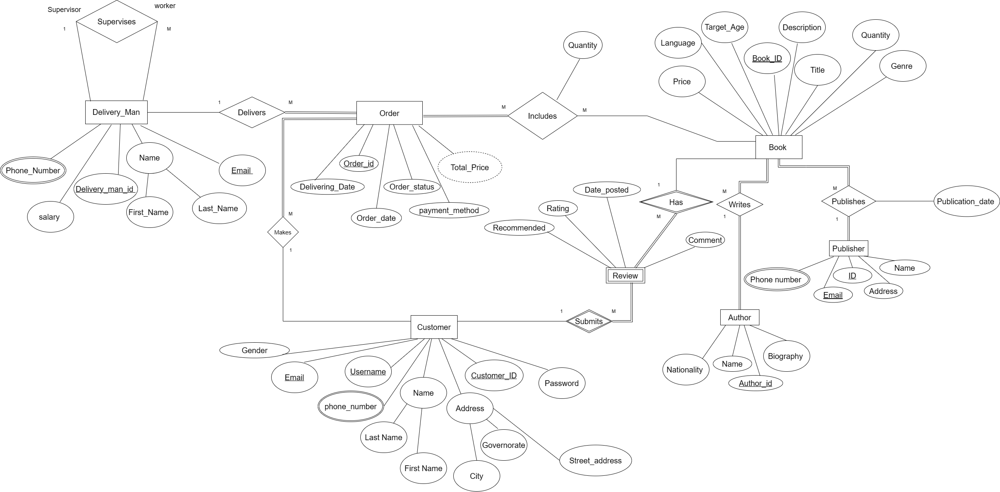
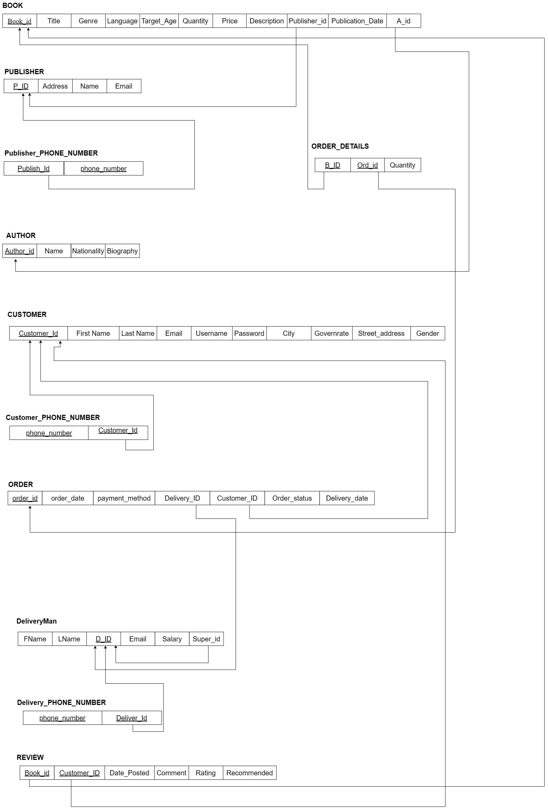
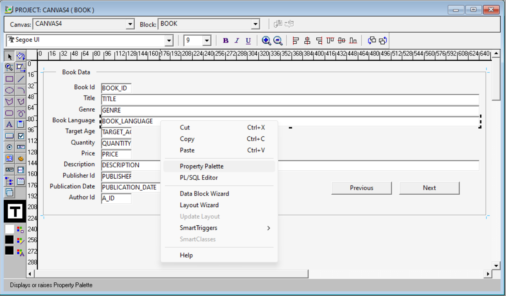
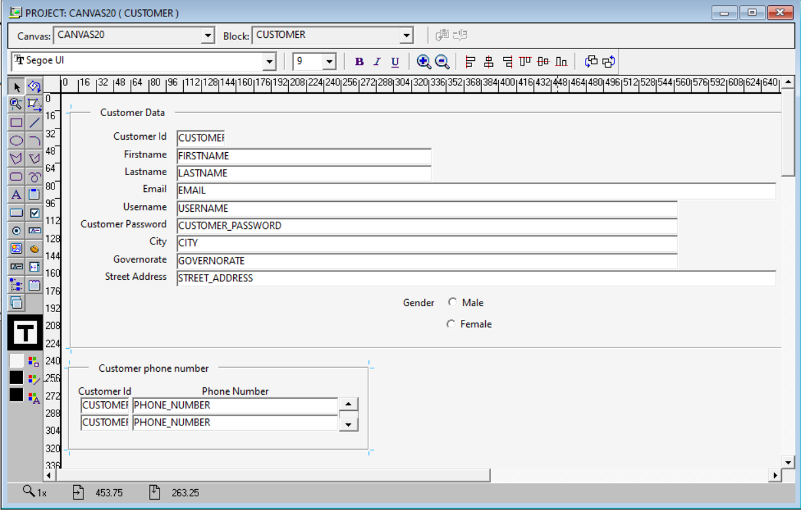
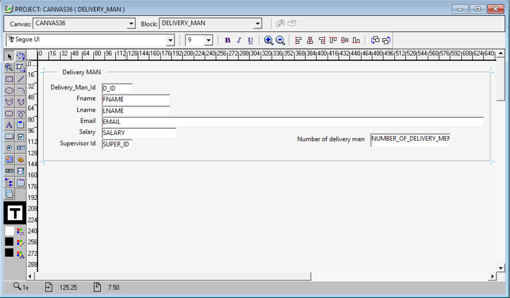
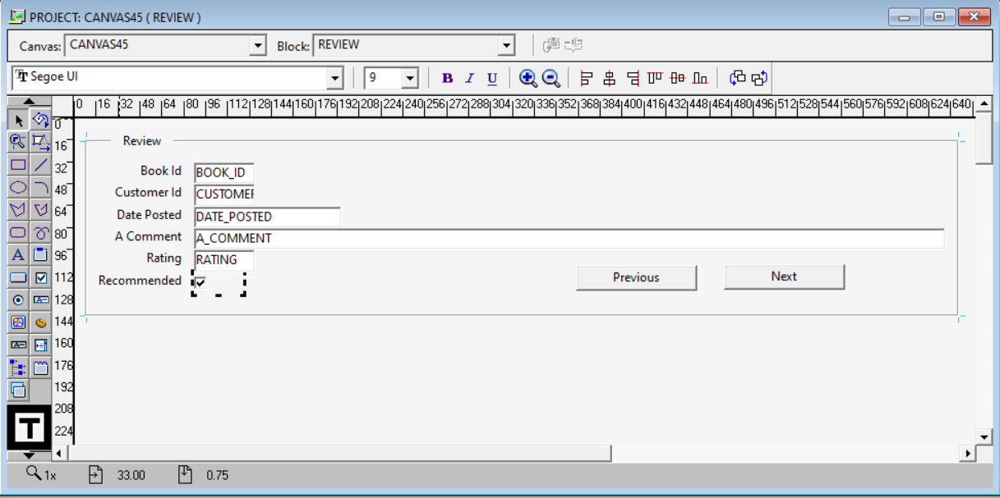

# 📚 Bookstore Management System

A comprehensive database management system for bookstore operations, designed and implemented using **Oracle SQL Developer** and **Oracle Forms Builder**.

---

## 📌 Project Overview

This project was developed as part of the **Database Management Systems (DBMS)** course at **Ain Shams University – Faculty of Computer and Information Sciences**.

The system manages all bookstore operations including books, authors, publishers, customers, orders, delivery, and reviews — with a full database design and interactive forms interface.

---

## 🗂️ Database Design

### Entities
| Entity | Description |
|--------|-------------|
| **Book** | Stores book details (title, genre, language, price, quantity, target age) |
| **Author** | Author info (name, nationality, biography) |
| **Publisher** | Publisher details (name, address, email, phone) |
| **Customer** | Customer profile (name, address, email, username, gender) |
| **Order** | Order info (date, payment method, status, delivery date) |
| **Delivery Man** | Delivery staff with supervisor relationship |
| **Review** | Customer reviews (rating, comment, recommended flag) |

### Relationships
- Customer **Makes** Orders (1:M)
- Order **Includes** Books (M:N) → resolved via `ORDER_DETAILS` table
- Book **Written by** Author (M:1)
- Book **Published by** Publisher (M:1)
- Customer **Submits** Reviews (1:M)
- Delivery Man **Delivers** Orders (1:M)
- Delivery Man **Supervises** Delivery Man (1:M) — recursive relationship

---

## 🗄️ Database Schema

```
BOOK          (Book_id, Title, Genre, Language, Target_Age, Quantity, Price, Description, Publisher_id, Publication_Date, A_id)
AUTHOR        (Author_id, Name, Nationality, Biography)
PUBLISHER     (P_ID, Address, Name, Email)
PUBLISHER_PHONE_NUMBER (Publish_Id, phone_number)
CUSTOMER      (Customer_Id, First_Name, Last_Name, Email, Username, Password, City, Governorate, Street_address, Gender)
CUSTOMER_PHONE_NUMBER  (phone_number, Customer_Id)
ORDER         (order_id, order_date, payment_method, Delivery_ID, Customer_ID, Order_status, Delivery_date)
ORDER_DETAILS (B_ID, Ord_id, Quantity)
DELIVERYMAN   (FName, LName, D_ID, Email, Salary, Super_id)
DELIVERY_PHONE_NUMBER  (phone_number, Deliver_Id)
REVIEW        (Book_id, Customer_ID, Date_Posted, Comment, Rating, Recommended)
```

---

## 🖥️ Oracle Forms Module

Built using **Oracle Forms Builder** with **4 Canvases**, utilizing:

- ✅ Check Box
- ✅ Radio Buttons
- ✅ Combo Box
- ✅ List of Values (LOV)
- ✅ Triggers
- ✅ Alert
- ✅ Master-Detail relationship
- ✅ Calculated Fields (Formula / Summary)

---

## 📸 Screenshots

### ERD (Entity Relationship Diagram)


### Database Schema


### Oracle Forms – Book Canvas


### Oracle Forms – Customer Canvas


### Oracle Forms – Delivery Man Canvas


### Oracle Forms – Review Canvas


---

## 🛠️ Technologies Used

- Oracle SQL Developer
- Oracle Forms Builder
- SQL (DDL, DML, Queries)
- ERD Design Tool (draw.io)

---

## 📁 Project Structure

```
📦 Bookstore-Management-System
 ┣ 📂 Canvas/                            # Oracle Forms Canvas screenshots
 ┃ ┣ 🖼️ Book_Canvas.png
 ┃ ┣ 🖼️ Customer_Canvas.png
 ┃ ┣ 🖼️ DeliveryMan_Canvas.png
 ┃ ┗ 🖼️ Review_Canvas.png
 ┣ 📂 Code/                              # SQL scripts (CREATE, INSERT statements)
 ┣ 📂 ERD&Schema/                        # ERD and Schema diagrams
 ┃ ┣ 🖼️ ERD.png
 ┃ ┗ 🖼️ Schema.png
 ┣ 📄 Bookstore Management System.fmb    # Oracle Forms source file
 ┣ 📄 Bookstore Management System.fmx    # Oracle Forms compiled file
 ┗ 📄 README.md
```

---

## 👩‍💻 Developer

**Fatma Mahmoud** — Computer Science Student, Ain Shams University  
[LinkedIn](https://linkedin.com/in/your-link) • [GitHub](https://github.com/your-username)

---
